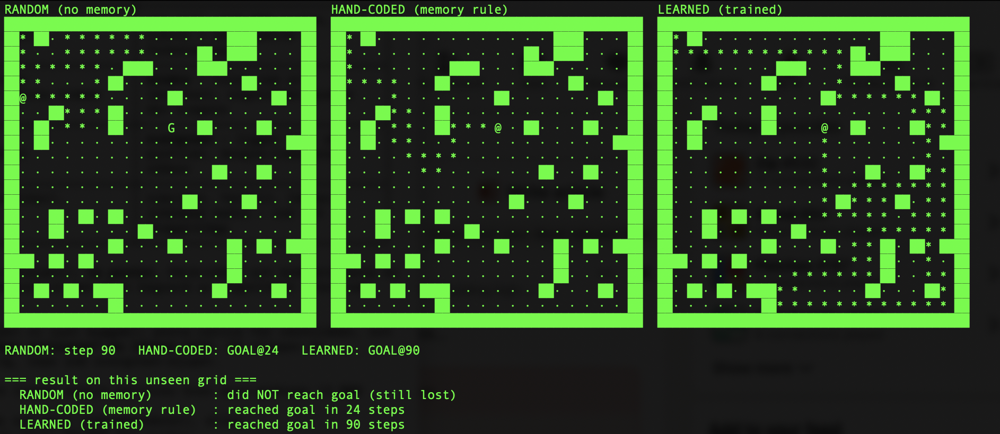
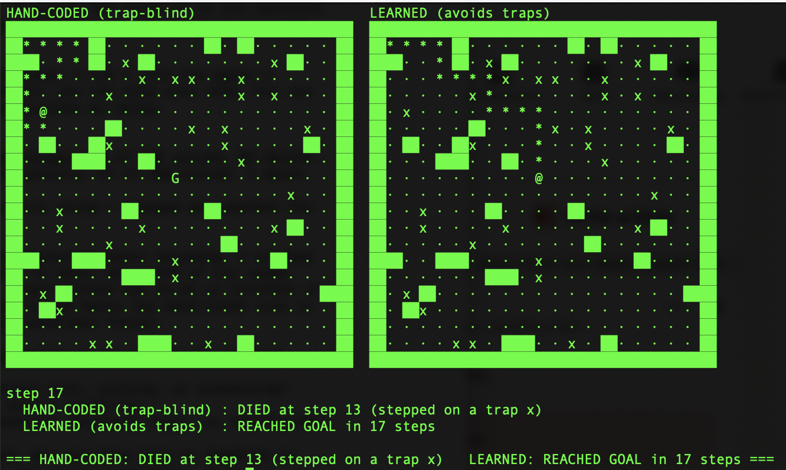

# llm-rungs: en handbyggd stege genom AI, en pinne i taget

Ett personligt lärprojekt: bygg praktisk AI/ML från grunden, en färdighet per fil, i ren Python
utan numpy och utan ramverk. Det började med en fråga:

> **När hjälper lärande faktiskt, och när gör det inte det?**

Allt nedan är något vi upptäckte genom att köra koden, inte genom att läsa om det. Nätet i
`rung9.py` är handskrivet så att inget förblir en svart låda.

---

## Kör det

```bash
python3 rung8.py     # tabulär Q-learning bemästrar EN labyrint (se den lära sig)
python3 rung9.py     # ett handskrivet nät vs en tabell på OSEDDA mål
python3 rung10.py    # generalisering över osedda banor   (-t träna+spara, -s ny bana)
python3 race.py      # 3 agenter sida vid sida: slump | handkodad | lärd   (-t, -s)
python3 rung11.py    # flippen: en DOLD dödlig regel, lärandet vinner   (-t, -s)
```

Ingen installation. Kräver Python 3.8+.

Varje bild nedan är en riktig terminal-capture av de faktiska agenterna. Inget genererat, inget
uppställt.

---

## Vad vi upptäckte

1. **En lärande agent kan bemästra en enda labyrint, perfekt, men bara den.** Tabulär Q-learning
   hittade den BFS-optimala 44-stegsbanan (BFS = kortaste-väg-oraklet vi mäter mot). Med state =
   den absoluta cellen memorerar den, och överför till ingenting.

2. **Byt state-representation så generaliserar samma lärare.** Byt "vilken cell är jag i" mot lokala
   särdrag (väggar runt mig, riktning mot målet) och den löser banor den aldrig tränat på, men bara
   på glesa banor. På täta banor kollapsar den: samma lokala vy betyder olika saker på olika ställen
   (state-aliasing), vilket kapar den runt 80%.

3. **Ett minne av besökta celler hjälper, men bryter inte det taket.** Taket handlar om vad agenten
   kan *känna av*, inte hur hårt den försöker.

4. **Ett nät slår en tabell när inputen är rik.** På kontinuerliga mål-offset fick tabellen 1% och
   det handskrivna nätet 97%. Tabellen kan inte interpolera mellan tillstånd den sett. Det kan nätet.

5. **Den ärliga rättvise-fixen: fri sikt, inte en alltid-på-kompass mot målet.** Agenten "ser" bara
   målet rakt ner längs en fri rad eller kolumn. Den lärde sig ändå (~88%), och det slutade kännas
   som fusk.

6. **En dum 5-raders handkodad regel slog den lärda agenten.** På vanliga glesa banor: handkodad
   91%, lärd ~82%. När den bra strategin går att skriva producerar inlärning från grunden bara en
   brusigare kopia av något du kunde ha skrivit direkt.

   
   *`race.py`: på denna osedda bana når slumpen aldrig målet, den handkodade tar sig dit på 24 steg, den lärda på 90.*

7. **Vi hade fel om den handkodade agenten, och mätte det.** Vi påstod att den aldrig trampar om.
   Det gör den, ~27% av sina steg (mot slumpens ~72%). Mätt, inte antaget.

8. **"Lärd vinner alltid på 17 steg" visade sig vara ett fel i hur vi tittade.** Loppet använde en
   fast seed, så det var deterministiskt. Med en ny slumpbana varje körning vinner handkodad oftast
   på pålitlighet, och lärd är bara ibland snabbare. Pålitlighet vs fart är en riktig avvägning,
   inte en vinnare.

9. **Mer träning hjälpte inte förbi en viss punkt. Den planade ut.** Den lärda agenten wobblade
   (82, 66, 76, 79) runt aliasing-taket. Om inputen saknar informationen fixar ingen mängd träning
   det.

10. **Flippen: göm en regel, så vinner lärandet.** Vi gjorde vissa rutor dödliga, gångbara men
    livsfarliga, och vilka är en hemlighet du bara lär dig genom att dö. Fäll-blind handkod: 15/100
    lösta, 85 dödsfall. Den lärda, enbart från döds-straffet: 45/100, 1 dödsfall. Samma två
    ansatser, motsatt vinnare. Det enda vi ändrade var om regeln var dold.

    
    *`rung11.py`: den handkodade dör på en fälla vid steg 13. Den lärda, som upptäckt den dolda regeln, når målet på 17 steg.*

**Vad allt pekar mot:** de avgörande spakarna är om *du* kan skriva regeln, och *representation*,
alltså vad agenten kan känna av och minnas. Lärandet förtjänar sin plats bara när regeln inte går
att skriva för hand, och dess värde växer med hur mycket av världen som är dolt.

---

*Ett personligt lärprojekt av Mikael Carlevigg. Ren Python, byggt för att förstå, inte för att
skeppa.*
